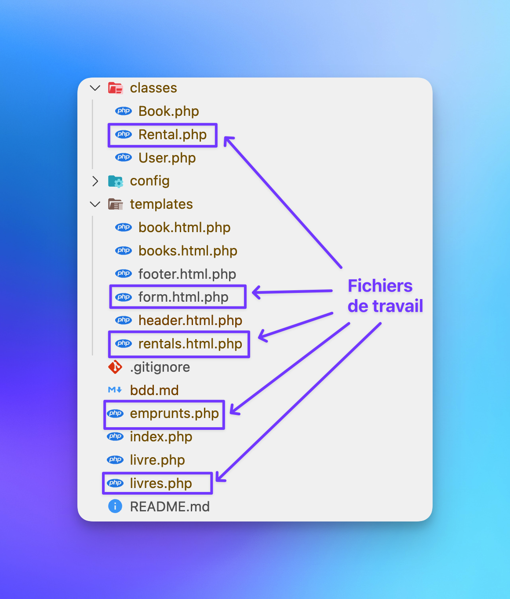
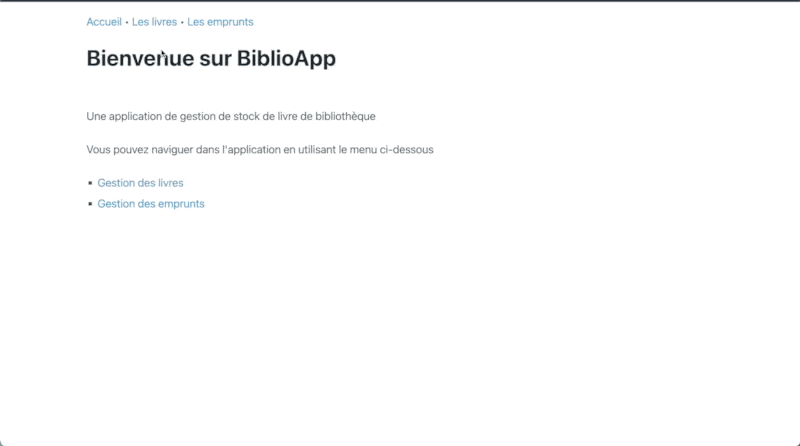

# AgiliExercise 6
Pour mes étudiant(e) en PHP

---

Les instructions pour la réalisation de ce TP sont simples :

Clonez ce dépôt dans votre répertoire de travail et ouvrez-le dans votre éditeur de code préféré.
L'interface est déjà prête, cependant, il faut encore ajouter les fonctionnalités. Pour cela, vous devez modifier les fichiers suivants :

## Les résultats attendus sont les suivants :

À l'aide des connaissances que vous avez acquises jusqu'à présent, vous devez :

- afficher la liste des emprunts à l'URL **/emprunts.php**, les informations sont le nom du livre et de la personne qui emprunte, ainsi que les dates.
- ajouter un formulaire d'emprunt sur la page de chaque livre : **/livre.php**

### Pour aller plus loin

- Créer un formulaire pour mettre à jour un emprunt.

---

## Comment rendre ta réalisation ?
1. Publie ton code dans un dépôt GitHub public et envoie-moi le lien du TP.

### Conseils
Consulte tes fichiers de cours, les projets que tu as précédemment réalisé, fais des recherches sur le web, la documentation php.net et sql.sh
